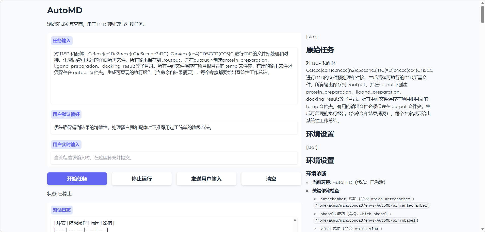

# AutoMD 智能体实现分子动力学模拟

---
## 实际效果图



## 技术路线：

### 1.Agents角色
详细见[Agents](./Agents)目录下的Agent定义。
[common.py](./Agents/common.py)提供了一个基础的问答框架，使用create_executor_agent和create_model_client作为外部接口。
修改create_executor_agent的工具列表(allowed_functions)和提示词模板(system_message_path)即可简单自定义各种模式的Agent。
[dsml_bridge.py](./Agents/dsml_bridge.py)作为补丁解决deepseek的api调用工具时返回DSML文本不兼容AutoGen的情况。
项目自定义了[env_setup_agent.py](./Agents/env_setup_agent.py),[protein_pre_agent.py](./Agents/protein_pre_agent.py),[ligand_pre_agent.py](./Agents/ligand_pre_agent.py),[dock_agent.py](./Agents/dock_agent.py),[memory_agent.py](./Agents/memory_agent.py),以及[main.py](./main.py)中定义的Coordinator

### 2.Agent功能
-  [env_setup_agent.py](./Agents/env_setup_agent.py) : 解决项目环境依赖问题。
-  [protein_pre_agent.py](./Agents/protein_pre_agent.py) : 能生成蛋白质在MD过程中所需要的一切文件。
-  [ligand_pre_agent.py](./Agents/ligand_pre_agent.py) : 能生成配体小分子在MD过程中所需要的一切文件。
-  [dock_agent.py](./Agents/dock_agent.py) : 通过p2rank预测口袋以及AutoDock vina进行对接。
-  [memory_agent.py](./Agents/memory_agent.py) : 能够维护项目目前进度文档的智能体。
-  [main.py](./main.py) : 定义了GroupChatOrchestrator使各智能体能根据Coordinator进行发言。

### 3.记忆功能
-  [memory_agent.py](./Agents/memory_agent.py) 通过维护一个项目目前进度文档实现任务内的短期记忆
每次独立的任务运行完成后，都会在[index.json](./memory/long_memory/index.json)下生成任务级别的记录。
在[events](./memory/long_memory/events/)下生成完整的事件回放，在[runs](./memory/long_memory/runs/)下生成基于[events](./memory/long_memory/events/)下事件回放的总结，最终的chunk来源即是[runs](./memory/long_memory/runs/)下的JSON文件。
每一个任务都会生成唯一的run_id，通过调用[creat_RAG.py](./memory/creat_RAG.py)脚本将对于的run_id切分chunk并且存入向量库，同时还能将对应的run_id任务记录从全流程中删除。
```
Build long-memory chunks and optionally update local vector DB for RAG.

Usage:
1) Update one run's chunks:
    python memory/creat_RAG.py 20260418_154035
2) Update one run + rebuild vector index:
    python memory/creat_RAG.py 20260418_154035 --build-vector --rebuild
3) Delete one run from index/runs/events/chunks/vector DB:
    python memory/creat_RAG.py 20260418_154035 --delete-run
```
RAG调用封装成工具仅提供给[main.py](./main.py)中定义的Coordinator，对应约束详细见Coordinator对应的Prompt：[Organizer.txt](./Prompts/Organizer.txt)


### 3. 具体技术实现

#### 3.1 protein_pre_agent（对应 tools/protein.py）

##### 核心流程
1. PDB 下载：`fetch_pdb(pdb_id, output_dir)`
- 从 RCSB 下载 `pdb_id.pdb`。
- 若本地已存在同名文件则直接复用。

2. 清洗与加氢：`run_pdb4amber(pdb_file, output_file, keep_hetatm=False)`
- 实际调用命令：`pdb4amber -i ... -o ... --reduce`。
- 当前实现不使用 `--dry`，也不内置 PDBFixer 路线。

3. 标准残基过滤：`filter_standard_protein_residues(input_pdb, output_pdb)`
- 仅保留 `STANDARD_PROTEIN_RESIDUES` 集合中的残基。
- 保留 `TER/END/ENDMDL` 记录，过滤非标准配体/离子/溶剂。

4. AMBER 拓扑生成：`run_tleap(clean_pdb, output_dir, box_padding=10.0, neutralize=True)`
- 力场：`ff19SB` + `TIP3P`。
- 进行溶剂化并加 `Na+` 中和。
- 生成 `complex.prmtop` 与 `complex.inpcrd`。

5. 对接受体 PDBQT：`run_prepare_receptor4_py(input_pdb, output_pdbqt)`
- 优先通过 `conda run -n mgltools python prepare_receptor4.py` 执行。
- 目标环境缺失或不可执行时会失败；脚本中包含 Open Babel 降级调用入口。

##### 主入口
- `prepare_pure_protein(pdb_id, output_root="./output")` 返回：
	- `raw_pdb`
	- `clean_pdb`
	- `protein_only_pdb`
	- `prmtop`
	- `inpcrd`

##### 常见失败分支（与当前实现一致）
- `pdb4amber/tleap` 不在 PATH：直接报错。
- 过滤后无标准残基：返回失败并终止。
- `mgltools` 环境不可用：`run_prepare_receptor4_py` 失败。

---

#### 3.2 ligand_pre_agent（对应 tools/ligand.py）

##### 核心流程
1. 输入标准化
- 支持 `input_smiles`、`input_pdb`、`input_file`。
- `SMILES -> PDB` 通过 RDKit（`smiles_to_pdb`）。
- 可自动推断输入格式（`pdb/mol2/sdf/...`）。

2. Antechamber 参数化：`run_antechamber(...)`
- 生成带 GAFF 原子类型与电荷的 `mol2`。
- 支持 `bcc/resp/gas`，支持重试与额外参数注入。
- 支持中间文件目录分轮保存，便于排错。

3. 缺失参数补全：`run_parmchk2(...)`
- 生成 `frcmod`，检测缺失参数提示信息。

4. tLEaP 拓扑：`run_tleap(...)`
- 生成 `prmtop/inpcrd`。
- 内置重复键去重重试（`_deduplicate_mol2_bonds`）。

5. 对接配体 PDBQT
- 优先 `run_prepare_ligand4_py`（mgltools 环境）。
- 失败时降级 `run_obabel_pdbqt`。

6. 可选 GROMACS 输出：`run_acpype(...)`
- 生成 `GMX.top/itp/gro`（依赖 `acpype`）。

##### 主入口
- `prepare_ligand_amber_route(...)` 输出字典可能包含：
	- `mol2`
	- `frcmod`
	- `prmtop`
	- `inpcrd`
	- `pdbqt`
	- `gmx_top/gmx_itp/gmx_gro`
	- 失败时：`error/error_detail/attempts` 等字段

##### 常见失败分支（与当前实现一致）
- `antechamber/parmchk2/tleap` 缺失：对应步骤失败。
- mgltools 不可用：PDBQT 回退到 Open Babel。
- 拓扑失败但 PDBQT 成功：可继续对接流程。

---

#### 3.3 dock_agent（对应 tools/dock.py）

##### 核心流程
1. 口袋预测：`run_p2rank(protein_pdb, output_dir)`
- 调用 `dock_tools/P2Rank/.../prank predict`。
- 输出并定位 `*_predictions.csv`。

2. 盒参数解析：`get_docking_box_from_p2rank(...)`
- 读取 top-1 口袋中心与残基信息。
- 可选用 PyMOL + GetBox 精确计算盒尺寸。
- GetBox 结果异常时可降级到简单尺寸估算。

3. 对接执行：`dock(...)`
- 强校验输入必须为 `protein.pdbqt` + `ligand.pdbqt`。
- 若未给中心，自动调用 `get_docking_box_from_p2rank`。
- 生成 Vina 配置并执行 `vina --config ...`。
- 输出：`docked.pdbqt`，并尽力转成 `docked.pdb`。

##### 返回结果
- 成功时返回摘要字符串，包含：
	- 最佳结合能（若可解析）
	- 输出文件路径
	- 盒中心与尺寸
- 失败时返回可读错误信息（缺依赖、超时、输入格式错误等）。

##### 常见失败分支（与当前实现一致）
- `vina` 未安装：直接返回错误。
- 输入不是 `.pdbqt`：直接拒绝执行。
- P2Rank/GetBox 失败：可回退简单盒子估算或报错。

---

### 4. 效果

[output/progress_report.md](./output/progress_report.md)是项目进行过程中维护的文档。
运行例子是PDB ID 1IEP 及其配体伊马替尼的redock(重对接)过程，伊马替尼是给定 SMILES 的情况下进行对接。

原始任务描述见[output/progress_report.md](./output/progress_report.md)中的 **原始任务** 下内容。

[output/docking_result/docked.pdbqt](./output/docking_result/docked.pdbqt)是最后的对接成果

在pymol中与原始1IEP的配体进行RMSD计算对接流程的可靠性，最后结果RMSD = 0.534，验证了流程在简单的对接任务上已经能够表现良好。

[history](./history/) 中保留了一个根据蛋白质系综进行分子对接的任务。

### 5. 使用方法

#### 5.1 api 配置
在.env中配置相关api

#### 5.2 运行环境配置
创建相关环境，[environment.yml](./environment.yml)是主环境，[environment-mgltools.yml](./environment-mgltools.yml)是MGLTOOLS运行时需要的 python 2.7 的环境。
配置环境：
```
conda env create -f environment.yml
conda env create -f environment-mgltools.yml
```

#### 5.2 运行
运行：
```
python ui_app.py
```
根据提示在浏览器中打开对应网址即可本地运行。


### 6. 补充
[dock_tools](./dock_tools/)保存了本项目用到的外部项目。
dock_tools下载链接：
https://pan.baidu.com/s/1QkR9b8Rk4KHLJI8DaGrQ8A 
提取码: bnnv
解压到项目根目录下即可

[local_sbert_model](./memory/RAG/local_sbert_model/) 作为 RAG 的Embedding model
下载链接如下：
https://wwaws.lanzouq.com/i6Q853o13cyd
解压到./memory/RAG/下即可。

[Agents_readme](./Agents_readme/)作为后续静态知识库的demo，目前未接入主流程


