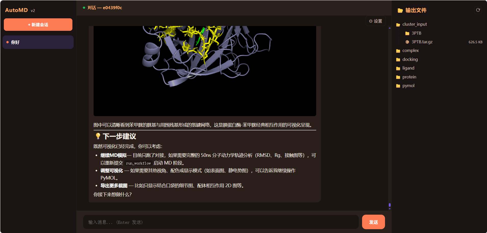
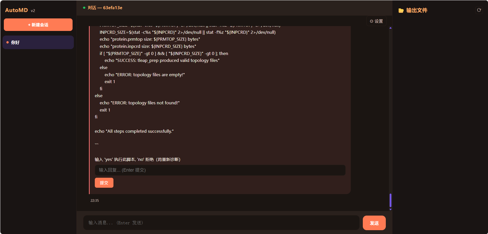

# AutoMD

> **TL;DR** — 多 LLM 协作的计算化学 agent: 自然语言发任务, AI 拆解 + 调用工具 + 自愈 + 出报告。
> 例: "1HX0 + 布洛芬盲对接 10ns MD" → 蛋白下载 → 配体准备 → 对接 → MD → HTML 报告。

## 这是什么

AutoMD 把"自然语言任务 → 工具调用 → 失败自愈 → 报告生成"链路封装为可重入的工作流, 面向非专业用户的 MD 自动化。
将常用的工具封装成固定的工作流，并且加入LLM进行节点失败自愈，避免用户花费过多时间在写脚本/修复环境/解决常见问题上。

### 支持的功能

- **蛋白准备**: PDB 下载、pdb4amber 清洗、缺失残基修补、二硫键检测、 tleap生成拓扑
- **配体处理**: SMILES → 3D 结构 (RDKit)、GAFF2 参数化、bcc 电荷
- **口袋检测**: P2Rank 盲对接预测
- **分子对接**: Vina 盲对接 / pymol 可视化对接
- **复合物准备**: tleap 溶水 + 中和 (Na⁺/Cl⁻)
- **MD 模拟**: 本地 OpenMM 或提交 HPC 集群 (slurm/pbs/lsf/sge)
- **轨迹分析**: RMSD、Rg、氢键、蛋白-配体相互作用
- **可视化**: PyMOL 实时加载 (XML-RPC)

### 架构组件

- `chat.py` — 多工具的 LLM 调度循环、流式输出、session 持久化
- `AutoMD_LangGraph/` — LangGraph 工作流, 节点化封装每个工具
- `fallback_agent` — 工作流自愈机制 (失败时自动修复)

## 目录

- [快速开始](#快速开始)
- [1. 项目架构](#1-项目架构)
  - [1.1 整体架构图](#11-整体架构图)
  - [1.2 关键节点 walk-through](#12-关键节点-walk-through)
- [2. fallback_agent 设计](#2-fallback_agent-设计)
- [3. 项目定位](#3-项目定位)
- [4. 补充](#4-补充)

## 快速开始

前置: Windows 10/11 + WSL 2 (Ubuntu) + Miniconda 或 Miniforge (推荐后者, 自带 mamba)。

### 1. 安装

```bash
# 1) 下载项目并且解压
# 下载链接：
# 百度网盘链接: https://pan.baidu.com/s/1yBn3f3-cOyNjDbTTge_f_g 提取码: 3r1e
# 或者在项目的 Releases 下载对应的AutoMD.zip文件 
# 解压到用户自己选择的目录下。

# 2) 环境支持
# 安装 Miniforge：
wget https://github.com/conda-forge/miniforge/releases/latest/download/Miniforge3-Linux-x86_64.sh
bash Miniforge3-Linux-x86_64.sh
# 重开 shell 让 conda init 生效

# 3) 一键安装两个 conda 环境
bash setup.sh
#     请确保当前没有同名环境AutoMD与mgltools，以免导致冲突
#   → 创建 AutoMD 环境 (OpenMM / AmberTools / RDKit / LangGraph)
#   → 创建 mgltools 环境 (Python 2.7, prepare_receptor4.py)
#   → 验证依赖

# 4) 配置 LLM_API_KEY
# 用记事本打开项目根目录下的.env文件，按照.env中的指引配置好相关api与变量，并保存。

# 5) 启动
# 打开 shell，进入到你的项目根目录下，输入：
conda activate AutoMD
python app.py

# 6) 运行成功
# 根据终端输出的网址(一般是 http://localhost:8765 )，在浏览器中打开即可。
```

控制台输出 `[AutoMD] 浏览器地址: http://localhost:8765` 即启动成功。

### 2. 浏览器访问

打开 <http://localhost:8765>, UI 布局:



在底部输入框提交任务, 例: `做个 1HX0 + 布洛芬的盲对接, 跑 10ns MD`。LLM 自动拆解并执行工作流, 对话区实时显示节点进度, 右栏实时显示生成的产物文件。

常用操作:

- 左侧 `+ 新建会话`: 并行多个任务
- `Enter` 发送, `Shift+Enter` 换行
- 右栏文件点击: 展开文件夹; 文件 → 查看 / 在 PyMOL 打开 / 复制路径 / 下载
- 右上 `⚙ 设置`: 切换主题

### 3. PyMOL 联动

项目支持 LLM 控制本地pymol，同时支持相关 pymol 原生 CLI。
需要在.env中根据指引配置相关变量才能使用。


---

## 1. 项目架构

### 1.0 双 LLM 协作

单 LLM 同时负责多轮工具调用与最终总结效果不佳, 故拆分为两个角色:

- **tool_llm** — 工具调用, 每轮必须调用一个工具 (`tool_choice="any"`)
- **self.llm** — 总结, 在工作流结束后基于工具 trace 生成 HTML 报告

tool_llm 持有一个"出口"工具 `chat_reply` (docstring 写"仅调此一个工具"), 调它即退出循环。

**问题 1: 幻觉调用** — 详细上文让 LLM 觉得能"猜"后续, 实际不调工具。`tool_choice="any"` 强制每轮必须调用, `chat_reply` 是合法的"我说完了"出口。

**问题 2: 总结 LLM 幻觉** — 把工具调用细节原样塞进总结 LLM 上文, 它会忘记自己不能调工具, 幻想继续调。`chat.py` 的 `_clean_tool_result()` 对每类工具单独清洗:

| 工具 | 清洗策略 |
|---|---|
| `pymol_execute` | 屏蔽 CLI 字符串, 只留 "PyMOL: N 成功, M 失败" + 失败对象名 |
| `query_pymol_knowledge` | 三段式信号: 成功 / 无相关答案 / 检索失败 |
| `read_output_file` | 截断到 800 字符 |
| `run_shell_command` | 只留 exit_code + 后 500 字符 |
| `pymol_status` / `pymol_start` | 只显示加载的对象 |

### 1.0.1 LangGraph 节点化

工作流每个节点封装一个工具, 满足:

1. 输出文件供后续节点使用
2. 节点只调用一个确定的 shell 命令 (通过 python 依赖生成文件)

节点统一返回 `ToolResult`:

```python
@dataclass
class ToolResult:
    status: "success" | "degraded" | "failed"
    data: 实际返回值
    degradation: 降级步骤, 如 ["antechamber bcc→gas", "MGLTools→OpenBabel"]
    errors: 错误列表 (即使已恢复也保留)
    warnings: 非致命警告
```

环境缺失时, 节点返回 `failed(errors=..., env_packages=...)`, 由 fallback_agent 决策修复方式。

### 1.1 整体架构图

```
                          ┌──────────────────┐
                          │      用户        │
                          └─────────┬────────┘
                                    │ HTTP / WebSocket
                                    ↓
                          ┌──────────────────┐
                          │   server.py      │ FastAPI 路由
                          │  (FastAPI)       │  /api/chat, /ws/run
                          └─────────┬────────┘
                                    │
                ┌───────────────────┴───────────────────┐
                │         chat.py ChatSession           │
                │   ┌──────────┐       ┌──────────┐     │
                │   │ tool_llm │       │ self.llm │     │
                │   │ 调工具   │       │ 总结     │      │
                │   │ 最多 15 轮│       │ HTML 输出│     │
                │   └─────┬────┘       └─────▲────┘     │
                │     ToolMessage (清洗后) ──┘           │
                │   多工具: chat_reply, run_workflow,    │
                │   pymol_*, read_output_file, ...       │
                └────────────┬───────────────────────────┘
                             │ run_workflow
                             ↓
                  ┌──────────────────────┐
                  │   LangGraph          │
                  │   蛋白 → 配体 → 对接  │
                  │   → MD → 轨迹分析    │
                  │   → 报告             │
                  │   (失败时 →          │
                  │    fallback_agent)   │
                  └──────────────────────┘
                             ↓
                  ┌──────────────────────┐
                  │  output/{sid}/       │  持久化
                  │  data/sessions/      │
                  └──────────────────────┘
```

**关键数据流**:
1. 用户消息 → `server.py` → `ChatSession.ask_stream()`
2. `tool_llm` 收到 messages, 返回 AIMessage(可能带 `tool_calls`)
3. `_execute_tool` 执行, 结果作为 ToolMessage 塞回 messages
4. 循环 2-3 直到 LLM 调 `chat_reply` 退出
5. `_stream_summary()` 把清洗后的工具 trace 喂给 `self.llm`, 输出 HTML
6. `run_workflow` 触发 LangGraph, 节点流式回报事件给前端, 跑完后再 `_stream_summary()`

### 1.2 关键节点 walk-through

```
用户: 帮我做 1HX0 + 布洛芬盲对接, 跑 10ns MD

[1] ChatSession.ask_stream(msg)
    self.messages = [SystemMessage(prompt), HumanMessage(msg)]

[2] tool_llm 第一次返回
    AIMessage(tool_calls=[{name: "run_workflow", args: '{"raw_task":"1HX0+...MD"}'}])

[3] run_workflow 启动 LangGraph run_automd(raw_task, thread_id=sid)
    通过 WebSocket 推送 30+ 事件 (section / step / log / report)

[4] WebSocket finally 块:
    a) _on_workflow_done(state) 合成 tool_calls/result
    b) _stream_summary() 主动调 summary LLM, 流式发 summary_token

[5] 前端展示: 事件日志 + 报告块 + summary LLM HTML 输出 + 流程完成标记

[6] 用户: 谢谢
[7] tool_llm 调 chat_reply → 退出循环
[8] self.llm 跑一轮, 输出自然语言回复
```

---

## 2. fallback_agent 设计

`fallback_agent` 由两个 LLM 协作修复节点错误:

- **诊断 LLM** — 仅一个工具 (read_file), 接收节点错误报告, 输出诊断结论
- **行动 LLM** — 结构化输出 `FallbackAction`, 仅看到诊断结论, 决策修复方式

```python
class FallbackAction(BaseModel):
    thought: str                              # 诊断推理
    action: Literal["run_script", "reroute", "escalate"]
    script: str                               # bash 脚本
    script_description: str
    state_updates: dict
    expected_outputs: list[str]               # 脚本即刻生成的文件
    final_outputs: list[str]                  # TMUX 后台任务完成后的文件
    next_node: str                            # 成功后跳转目标
    user_summary: str
```

**`run_script` 模式**: 行动 LLM 写 shell 脚本, 前端展示脚本内容并要求用户输入 `yes` 才执行。

**重试机制**: 脚本若未覆盖失败结果, 失败原因入 state, 再次调用 `fallback_agent` (诊断 LLM 看到原错误 + 历史错误)。成功后历史清空, 重试上限前会一直循环。

### 2.1 fallback_agent 安全性
每次运行脚本前，fallback_agent 都会输出在前端供用户审查，用户可以输入“no”来拒绝本次脚本的执行
同时以“低”，“中”，“高”三个档次标注风险，同时还会附上脚本的预计产物以及编写脚本的原因。




---

## 3. 项目定位

面向**非专业用户快速获得可靠 MD 结果**的 agent 项目, 同时作为 LangGraph 工作流的可复用框架:

- 工作流选最常用工具 + 最常用流程
- 任何可被 Python 调用的 workflow 都可封装为节点
- `fallback_agent` 模式可复用到其它工作流

通过自定义 workflow 并封装为工具, 即可让前端 LLM 调用, 框架与具体流程解耦。
项目框架迁移性强，需要专业人士封装相关workflow。

---

## 4. 补充

### 4.1 工作流日志
每次LangGraph封装的[workflow](./AutoMD_LangGraph/graph.py)运行完成后都会留下工作流日志
工作流日志按统一结构落盘,工作流日志统一储存在[AutoMD_LangGraph/log](./AutoMD_LangGraph/log/)下
工作流日志可作为 RAG 数据源，LLM 统一解析错误原因和解决脚本，能帮助下次同类问题快速准确地写出修复脚本。
但目前尚未启用，因为当前样本太少，后续可以考虑专业人士编写常见的类工作流日志。

### 4.2 集群提交
当前集群提交节点[submit.py](./AutoMD_LangGraph/nodes/submit.py)提供提交MD相关文件到集群地方式。
- 用户自己手动提交，.env中令CLUSTER_MODE=manual，流程内会自动打包相关文件和脚本，需要用户自己提交集群并运行。

### 4.3 License

本项目以 **MIT License** 发布 — 见 [LICENSE](./LICENSE)。

**第三方代码** (各自协议独立, 保留原 LICENSE):

- [MGLTools](https://mgldev.scripps.edu/) (含 AutoDockTools) — `AutoMD_LangGraph/dock_tools/mgltools/`
- [P2Rank](https://github.com/rdkoval/p2rank) — `AutoMD_LangGraph/dock_tools/P2Rank/`
- [GetBox PyMOL Plugin](https://github.com/MengwuXiao/GetBox-PyMOL-Plugin) — `AutoMD_LangGraph/dock_tools/GetBox/`

**PyMOL 不打包** — 用户需自装 ([pymol.org](https://pymol.org/))。PyMOL 是 Schrödinger, LLC 的注册商标。

### 4.4 安装体积

| 项 | 大小 | 备注 |
|---|---:|---|
| LangGraph conda 环境 | ~3.5 GB | OpenMM 1.2G + AmberTools 1.5G + RDKit 300M + MDTraj 200M + 其它 |
| mgltools conda 环境 | ~330 MB | Python 2.7 + numpy 1.16 + scipy 1.2 |
| dock_tools/mgltools (可选) | ~450 MB | `AutoMD_LangGraph/dock_tools/mgltools/`, gitignored |
| **合计 (无 dock_tools)** | **~3.8 GB** | |
| **合计 (有 dock_tools)** | **~4.3 GB** | |

AmberTools (1.5GB) + OpenMM (1.2GB) 占大头, 科学计算包无替代方案。

### 4.5 后续（待完善）

[knowledge](./knowledge/) 作为 LLM 的静态知识库，可以帮助前端LLM更好的协助用户工作。
当前只补充了 pymol 相关内容，可以以此为模板添加其余的内容，用户可自己添加。
**注意**新增的文件夹必须有[INDEX.md](./knowledge/pymol/INDEX.md)，内容以[INDEX.md](./knowledge/pymol/INDEX.md)为模板根据实际情况填写即可。

[prompt](./prompt/)内存放关键架构的LLM的prompt，精心构建prompt可以提升性能。
